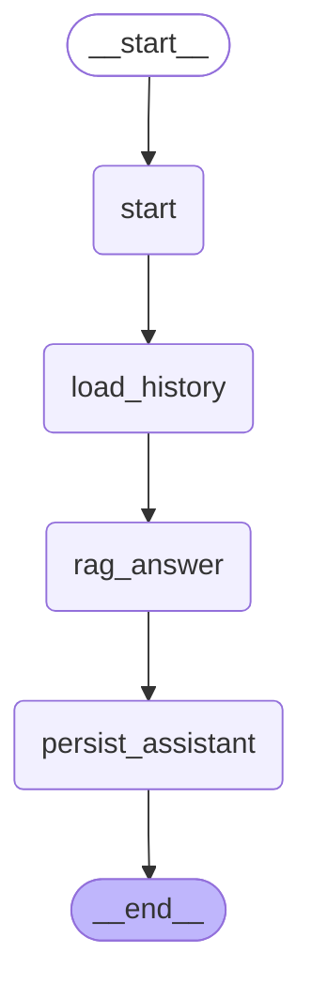

# RAG Conversation Flow

LangGraph가 실행하는 현재 `/chat` 대화/RAG 흐름입니다.

## Node responsibilities

- `start`: 사용자 메시지를 conversation/message 테이블에 저장합니다.
- `load_history`: 기존 대화 이력을 불러옵니다.
- `rag_answer`: 질문 의도 확인, 검색, grading, rewrite, 답변 생성을 수행합니다.
- `persist_assistant`: assistant 답변과 citation/trace metadata를 저장합니다.

## Important branches inside `rag_answer`

- 인사/잡담(`hi`, `안녕하세요` 등)은 retrieval을 건너뛰고 안내 답변을 반환합니다.
- 법령 조문 질문은 vector search 결과에 조문번호/법령명 lexical boost를 병합합니다.
- 검색 점수가 부족하면 insufficient evidence 경로로 이동하고 출처를 조작하지 않습니다.
- 충분한 근거가 있으면 LangChain OpenAI answer provider가 근거 기반 답변을 생성합니다.
